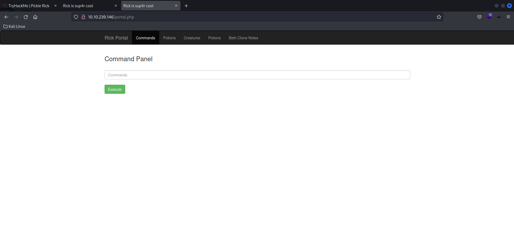

## Pickle Rick [THM]


Link: https://tryhackme.com/room/picklerick

Goal: 3 ingredients

## nmap
```
nmap -sC -sV 10.10.239.146
Starting Nmap 7.94 ( https://nmap.org ) at 2023-08-03 01:16 EDT
Nmap scan report for 10.10.239.146
Host is up (0.20s latency).
Not shown: 998 closed tcp ports (conn-refused)
PORT   STATE SERVICE VERSION
22/tcp open  ssh     OpenSSH 7.2p2 Ubuntu 4ubuntu2.6 (Ubuntu Linux; protocol 2.0)
| ssh-hostkey: 
|   2048 26:b8:db:57:8e:5e:eb:02:67:85:ed:05:0e:6f:21:21 (RSA)
|   256 c9:6c:1b:55:0b:76:f7:e8:7c:bd:ea:1b:8f:71:24:bb (ECDSA)
|_  256 50:13:32:5d:a9:1a:43:47:22:ce:e1:d8:de:79:b6:25 (ED25519)
80/tcp open  http    Apache httpd 2.4.18 ((Ubuntu))
|_http-title: Rick is sup4r cool
|_http-server-header: Apache/2.4.18 (Ubuntu)
Service Info: OS: Linux; CPE: cpe:/o:linux:linux_kernel

Service detection performed. Please report any incorrect results at https://nmap.org/submit/ .
Nmap done: 1 IP address (1 host up) scanned in 41.96 seconds
```
- port 22 open
- port 80 open

## view web [port 80]


- view source code


- found username: R1ckRul3s, maybe for web login

## dirsearch

```
dirsearch -u 10.10.239.146

Extensions: php, aspx, jsp, html, js | HTTP method: GET | Threads: 30 | Wordlist size: 10927

Target: http://10.10.239.146/

[01:22:11] Starting: 
[01:22:53] 200 -    2KB - /assets/                                             
[01:23:12] 200 -    1KB - /index.html                                       
[01:23:15] 200 -  882B  - /login.php                                        
[01:23:29] 200 -   17B  - /robots.txt                                       
                          
Task Completed                       
```

## robots.txt


- found maybe password: Wubbalubbadubdub

## login.php


- login page



- successfully login using Username: R1ckRul3s, Password: Wubbalubbadubdub

## ls


## first ingredient

- goto /Sup3rS3cretPickl3Ingred.txt, found ingredient 1: mr. meeseek hair


- goto /clue.txt


## pwd


- based on clue maybe we can change directory

## ls /home/rick


## second ingredient

- since cmd `cat` is disable, im using `less '/home/rick/second ingredients'`


## privilege escalation

- using `sudo -l`


- nice, sudo can be access without a password, we can change directory to /root easily.


- see, we got root!, im using `sudo ls -lah /root`

## third ingredient

- im using `sudo less /root/3rd.txt`


- PWNED! :star:
